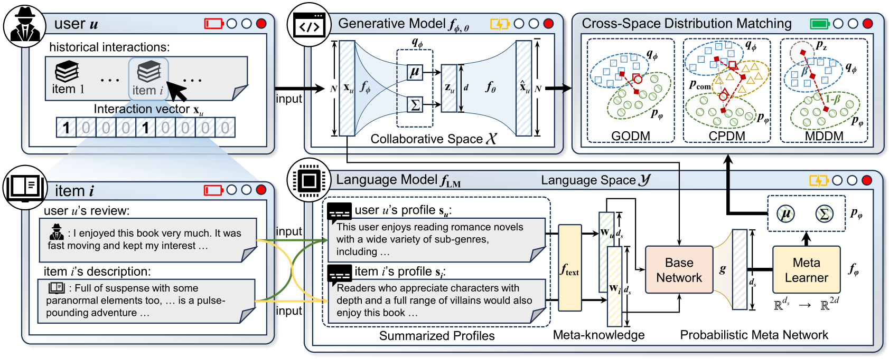

# DMRec

**The code and dataset files are being organized. Stay tuned!**

This is the PyTorch implementation for our SIGIR 2025 paper:
> Yi Zhang, Yiwen Zhang*, Yu Wang, Tong Chen, and Hongzhi Yin*. 2025. [Towards Distribution Matching between Collaborative and Language Spaces for Generative Recommendation](https://arxiv.org/abs/2504.07363). In Proceedings of the 48th International ACM SIGIR Conference on Research and Development in Information Retrieval (SIGIR’25).

<p align="center">

</p>

## Environment
```
python == 3.8.18
pytorch == 2.1.0 (cuda:12.1)
torch-sparse == 0.6.18
scipy == 1.10.1
numpy == 1.24.3
yaml == 0.2.5
```

## Examples to run the codes
We adopt three widely used recommendation datasets: Amazon-Book, Yelp, and Steam used in previous work. DMRec is a recommendation framework, which means you need to first define the base model to be run, and then select three matching strategies (GODM, CPDM, and MDDM). The following are examples of runs on three datasets:

- Global Optimality for Distribution Matching:

  `python train_encoder.py --model {model_name}_godm --dataset {dataset} --cuda 0`
  
- Composite Prior for Distribution Matching:

  `python train_encoder.py --model {model_name}_cpdm --dataset {dataset} --cuda 0`
  
- Mixing Divergence for Distribution Matching:

  `python train_encoder.py --model {model_name}_mddm --dataset {dataset} --cuda 0`

The hyperparameters of each model are stored in `encoder/config/modelconf`. The most important hyperparameter is the trade-off coefficient `beta`, and the other hyperparameters can be set by default. The `encoder/log` folder provides training logs for reference. The results of a single experiment may differ slightly from those given in the paper because they were run several times and averaged in the experiment.

## Acknowledgement
To maintain fair comparisons and consistency, the model training framework, the user (item) profiles generated by LLM and their corresponding embedding representations are mainly adapted from the following repo: 
>[https://github.com/HKUDS/RLMRec]

Many thanks to them for providing the training framework and for the active contribution to the open source community.

## Citation
If you find this work is helpful to your research, please consider citing our paper:
```
@article{zhang2025towards,
  title={Towards Distribution Matching between Collaborative and Language Spaces for Generative Recommendation},
  author={Zhang, Yi and Zhang, Yiwen and Wang, Yu and Chen, Tong and Yin, Hongzhi},
  journal={arXiv preprint arXiv:2504.07363},
  year={2025}
}
```
